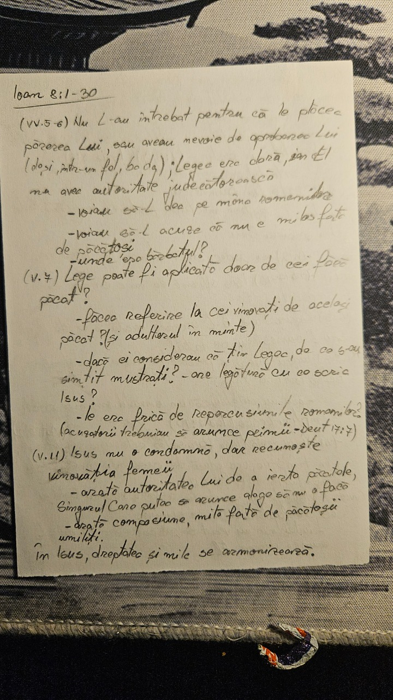
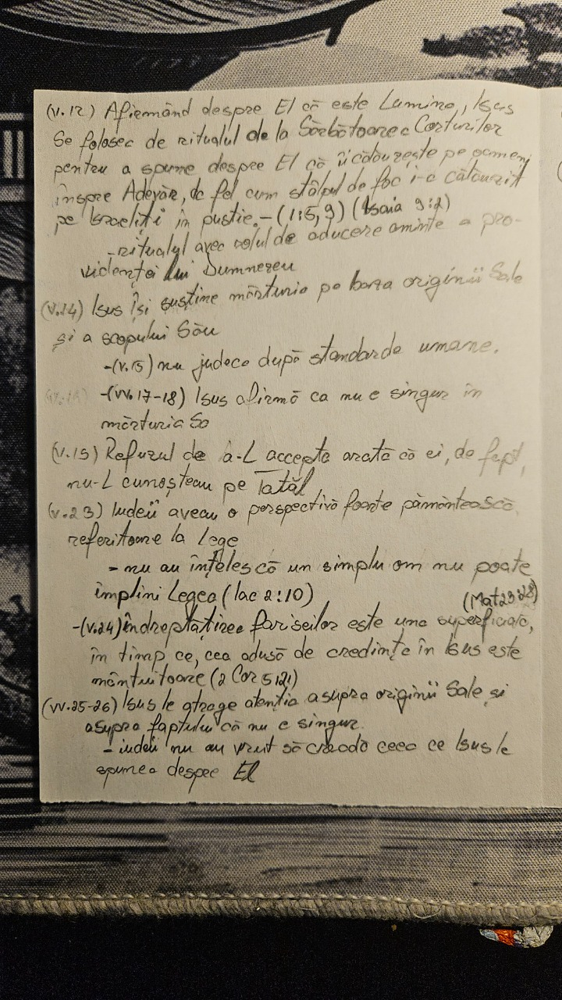

# Hand Notes

  

This is a personal server that receives photos of handwritten notes, transcribes them into structured markdown format using GeminiAPI and saves them to Google Drive.

  

---

## Features

- **AI transcription**: Converts image(JPEG, PNG, WebP) of handwriting into clean Markdown
- **Google Drive Integration** Creates files directly in Google Drive
- **Structured Organization**:  Supports nested folder navigation for better organizations
- **Rate Limiting**: Protects the service from excessive requests to ensure stability

  

---

## Authentication
All endpoints require an API key passed as a request header: X-API-Key: your_secret_key

---
## Tech Stack

| Layer    | Technology used                                             |
| -------- | ----------------------------------------------------------- |
| Backend  | FastAPI                                                     |
| Cloud    | Google Drive                                                |
| AI       | Gemini 3.0-flash-preview and Gemini-3.1-flash-lite-preview  |

  
  

---

## Project structure
```
├── root/
│    ├── routers/
│    │   ├── folders.py
│    │   └── notes.py
│    ├── services/
│    │   ├── gemini_service.py
│    │   ├── google_auth.py
│    │   └── google_drive.py
│    ├── main.py
│    ├── schemas.py
│    └── security.py
```

---

## API Overview

Base URL(local): http://localhost:8000

### Example
Request:
```
curl -X GET "http://localhost:8000/folders" -H "X-API-Key: yout_secret_key"
```
Response:
```
{
	"folders" : \[
		{
			"id" : "1BxiMVs0XRA5nFMdKvBdBZjgmUUqptlbs",
			"name" : "University Notes"
		}
	]
			
}
```

### GET /healthz
**Description**: Checks server status
**Parameters**: None
**Rate limit**: No
**Response (200 OK)**: 
```
{
	"status" : "ok"
}
```

### GET /folders
**Description**: Retrieves top layer folders
**Parameters**: None
**Rate limit**: No
**Response (200 OK)**:
```
{
	"folders" : \[
		{
			"id" : "1BxiMVs0XRA5nFMdKvBdBZjgmUUqptlbs",
			"name" : "University Notes"
		}
	]
}
```

**Errors**:
401 - Missing Token

### GET /folders/folder_id/subfolders
**Description**: Retrieves subfolders of specified folder
**Path parameters**:
  
| Name       | Type         | Required | Description                                                     |
| ---------- | ------------ | -------- | --------------------------------------------------------------- |
| folder_id  | string       | Yes      | Google Drive Folder Id(alphanumeric) to retrieve subfolders for |

**Rate limit**: No

**Response (200 OK)**:
```
{
	"subfolders" : \[
		{
			"id" : "1mljhtss0XRA5nFMdKvBdBZjgmUUqptlbs",
			"name":"Lectures"
		},
		{
			"id" : "1unghfrs0XRA5nFMdKvBdBZjgmUUqptlbs",
			"name" : "Seminars"
		},
		{
			"id" : "1asdsass0XRA5nFMdKvBdBZjgmUUqptlbs",
			"name" : "Labs"
		}
	]
}
```

**Errors** :
404 - Folder Not Found
401 - Missing Token


### POST /notes
**Description**: Creates a markdown note from text
**Body parameters**:

| Name       | Type         | Required  | Description                                                                                                   |
| ---------- | ------------ | --------- | ------------------------------------------------------------------------------------------------------------- |
| filename   | string       | Yes       | Name of the resulting markdown file                                                                           |
| content    | string       | Yes       | Content of the note                                                                                           |
| folder_id  | string       | No        | Google Drive ID(alphanumeric) in which to save the note (Default Folder ID is set as an environment variable) |

**Rate limit**: No
**Response (200 OK)**:
```
{ 
	"id":  "1mljhtss0XRA5nFMdKvBdBZjgmUUqptlbs" 
}
```

**Errors**
400 - Folder not set in parameters or env var
404 - Folder Not Found
401 - Missing Token

### POST /notes/from-images
**Description**: Converts images of handwriting to structured markdown note
**Body parameters**:

| Name       | Type           | Required  | Description                                                                                                   |
| ---------- | -------------- | --------- | ------------------------------------------------------------------------------------------------------------- |
| filename   | string         | Yes       | Name of the resulting markdown file                                                                           |
| files      | List \<File>   | Yes       | Photos(JPEG, PNG, WebP) of handwritten notes                                                                  |
| folder_id  | string         | No        | Google Drive ID(alphanumeric) in which to save the note (Default Folder ID is set as an environment variable) |

**Rate limit**: 5 requests/minute per IP
**Max size per request**: 19 MB

**Response (200 OK)**:
```
{
	"message":  "Note created successfully from the images",
	"file_id": "1mljhtss0XRA5nFMdKvBdBZjgmUUqptlbs",
	"images processed": 3,
	"markdown_preview": "First 300 characters of the resulting note ..."
}
```

**Errors**
400 - Folder not set in parameters or env var; File has unsupported type
413 - Payload request exceeds maximum size
404 - Folder Not Found
401 - Missing Token
500 - Gemini Transcription Failed


---


## Environment Variables

| Variable                 | Required | Description                                                        |
| ------------------------ | -------- | ------------------------------------------------------------------ |
| DEFAULT_FOLDER_ID        | No       | Default folder if folder id not set in body parameters             |
| DEFAULT_PHOTO_FOLDER_ID  | No       | Folder to save photos received in requests                         |
| MY_SECRET_KEY_API_KEY    | YES      | API Key to restrict access to only one user                        |
| GEMINI_API_KEY           | YES      | API Key to access the Gemini Services                              |
| GOOGLE_TOKE_PATH         | YES      | Path to `token.json` in secrets 								   | 


---
## Setup & Run locally

### 1. Prerequisites
- Python 3.10+
- A Google Cloud Project with Google Drive API enabled
- A Gemini API Key
### 2. Installation
```
git clone https://github.com/DavidCroitor/note-taking-server
cd note-taking-server
python -m venv .venv
.venv\Scripts\activate
pip install -r requirements.txt
```
### 3. Configuration
create `.env` file in the root directory and populate with the variables listed at [Environment Variables](#Environment Variables) section.
**Note on Google Credentials:**
1. Go to the [Google Cloud Console](https://cloud.google.com).
2. Create "OAuth 2.0 Client IDs" and download the JSON. Save it as `credentials.json` (This corresponds to `GOOGLE_CREDENTIALS_JSON`).
3. On the first run, the application will typically generate a `token.json` (This corresponds to `GOOGLE_TOKEN_JSON`). If you already have one, provide the content in the `.env`
### 4. Running the Server

Start the server using `uvicorn`:

```
uvicorn main:app --reload
```

The server will be available at `http://localhost:8000`.


---
## Example 

**Input photos**:





**Output**:
# Ioan 8:1-30

**(vv. 5-6)** Nu L-au întrebat pentru că le plăcea părerea Lui, sau aveau nevoie de aprobarea Lui (deși, într-un fel, ba da); Legea era clară, iar El nu avea autoritate judecătorească
- voiau să-L dea pe mâna romanilor
- voiau să-L acuze că nu e milos față de păcătoși
- unde era bărbatul?

**(v. 7)** Legea poate fi aplicată doar de cei fără păcat?
- făcea referire la cei vinovați de același păcat? (și adulterul în minte)
- dacă ei considerau că țin Legea, de ce s-au simțit mustrați? - are legătură cu ce scria Isus?
- le era frică de repercusiunile romanilor? (acuzatorii trebuiau să arunce primii - Deut 17:7)

**(v. 11)** Isus nu o condamnă, dar recunoaște vinovăția femeii
- arată autoritatea Lui de a ierta păcatele, singurul care putea să arunce alege să nu o facă
- arată compasiune, milă față de păcătoșii umiliți.

În Isus, dreptatea și mila se armonizează.

**(v. 12)** Afirmând despre El că este Lumina, Isus se folosește de ritualul de la Sărbătoarea Corturilor pentru a spune despre El că îi călăuzește pe oameni înspre Adevăr, de fel cum stâlpul de foc i-a călăuzit pe israeliți în pustie. - (1:5, 9) (Isaia 9:2)
- ritualul avea rolul de aducere aminte a providenței lui Dumnezeu

**(v. 14)** Isus își susține mărturia pe baza originii Sale și a scopului Său
- (v. 15) nu judecă după standarde umane.

**(vv. 17-18)** Isus afirmă că nu e singur în mărturia Sa

**(v. 19)** Refuzul de a-L accepta arată că ei, de fapt, nu-L cunoșteau pe Tatăl.

**(v. 23)** Iudeii aveau o perspectivă foarte pământească referitoare la Lege
- nu au înțeles că un simplu om nu poate împlini Legea (Iac 2:10) (Mat 23:28)

**(v. 24)** îndreptățirea fariseilor este una superficială, în timp ce cea adusă de credința în Isus este mântuitoare (2 Cor 5:21)

**(vv. 25-26)** Isus le atrage atenția asupra originii Sale și asupra faptului că nu e singur.
- iudeii nu au vrut să creadă ceea ce Isus le spunea despre El

**(v. 28)** Momentul crucificării i-a făcut pe mulți să înțeleagă cine este Isus

**(v. 29)** Tatăl și Fiul sunt într-o unitate perfectă, având aceeași voință.

---

## Future Work

- **Multiple User Support**: Transition from a single-user API key to multi-users with individual accounts and authentication.
- **Dynamic Token Management**:Implement a database-backed session management system to handle multiple Google Drive tokens securely.
- **Note Retrieval**: Add note retrieval
- **Self hosted LLM**: Switch from Gemini API to Self-Hosted LLM
